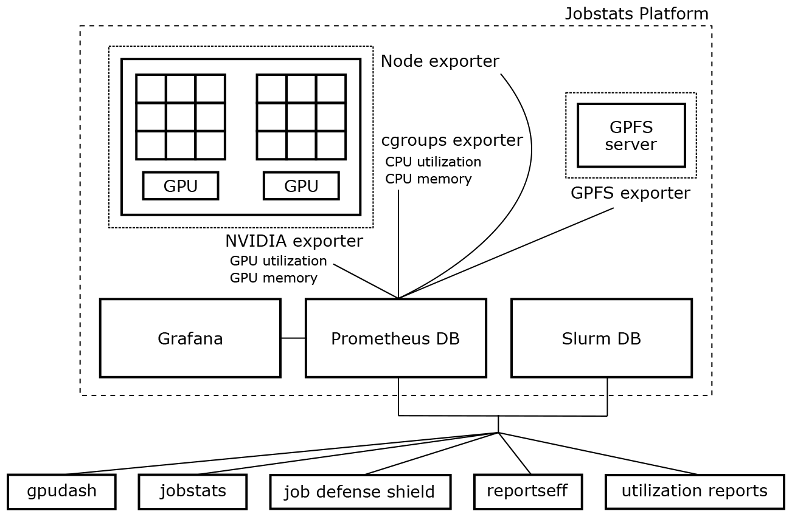

# What is Jobstats?

Jobstats is a free and open-source job monitoring platform designed for CPU and GPU clusters that use the Slurm workload manager. It was released in 2023 under the GNU GPL v2 license. Visit the [Jobstats GitHub repository](https://github.com/PrincetonUniversity/jobstats).

## What are the main benefits of Jobstats over other platforms?

The main advantages of Jobstats are:

- no action is required by the user 
- utilization and memory usage for each allocated GPU
- automatically cancel jobs with 0% GPU utilization ([more info](https://princetonuniversity.github.io/job_defense_shield/))
- accurate CPU memory usage for jobs of any size
- graphical interface for inspecting job metrics versus time
- efficiency reports contain job-specific notes to guide users
- automated emails to users for instances of underutilization ([more info](https://princetonuniversity.github.io/job_defense_shield/))
- periodic reports on usage and efficiency for users and group leaders
- all of the above features work with Open OnDemand jobs

## How does Jobstats work?

A schematic diagram of the components of the Jobstats platform and the external tools is shown below:



A compute node with two sockets is shown in the upper left. The dotted line around the node indicates the three node-level exporters, namely, Node, cgroups and NVIDIA. A GPFS server is shown in the upper right with its cluster-level GPFS exporter. The exporters serve to make data available to the [Prometheus](https://prometheus.io/) database. Users interact with the Prometheus and Slurm data via the web interface (i.e., [Grafana](https://grafana.com/grafana/)) and external tools (e.g., `jobstats`).

## Which institutions are using Jobstats?

Jobstats is used by these institutions:

- Brown University - Center for Computation and Visualization
- Free University of Berlin - High-Performance Computing
- George Mason University - Office of Research Computing
- Johns Hopkins University - Advanced Research Computing
- Monash University - e-Research
- NAVER LABS Europe
- Princeton University - Computer Science Department
- Princeton University - Research Computing
- University of Queensland - Research Computing Centre
- University of Virginia - Research Computing
- Yale University - Center for Research Computing
- and more


## What does a Jobstats efficiency report look like?

The `jobstats` command generates a job report:

```
$ jobstats 39798795

================================================================================
                              Slurm Job Statistics
================================================================================
         Job ID: 39798795
  NetID/Account: aturing/math
       Job Name: sys_logic_ordinals
          State: COMPLETED
          Nodes: 2
      CPU Cores: 48
     CPU Memory: 256GB (5.3GB per CPU-core)
           GPUs: 4
  QOS/Partition: della-gpu/gpu
        Cluster: della
     Start Time: Fri Mar 4, 2022 at 1:56 AM
       Run Time: 18:41:56
     Time Limit: 4-00:00:00

                              Overall Utilization
================================================================================
  CPU utilization  [|||||                                          10%]
  CPU memory usage [|||                                             6%]
  GPU utilization  [||||||||||||||||||||||||||||||||||             68%]
  GPU memory usage [|||||||||||||||||||||||||||||||||              66%]

                              Detailed Utilization
================================================================================
  CPU utilization per node (CPU time used/run time)
      della-i14g2: 1-21:41:20/18-16:46:24 (efficiency=10.2%)
      della-i14g3: 1-18:48:55/18-16:46:24 (efficiency=9.5%)
  Total used/runtime: 3-16:30:16/37-09:32:48, efficiency=9.9%

  CPU memory usage per node - used/allocated
      della-i14g2: 7.9GB/128.0GB (335.5MB/5.3GB per core of 24)
      della-i14g3: 7.8GB/128.0GB (334.6MB/5.3GB per core of 24)
  Total used/allocated: 15.7GB/256.0GB (335.1MB/5.3GB per core of 48)

  GPU utilization per node
      della-i14g2 (GPU 0): 65.7%
      della-i14g2 (GPU 1): 64.5%
      della-i14g3 (GPU 0): 72.9%
      della-i14g3 (GPU 1): 67.5%

  GPU memory usage per node - maximum used/total
      della-i14g2 (GPU 0): 26.5GB/40.0GB (66.2%)
      della-i14g2 (GPU 1): 26.5GB/40.0GB (66.2%)
      della-i14g3 (GPU 0): 26.5GB/40.0GB (66.2%)
      della-i14g3 (GPU 1): 26.5GB/40.0GB (66.2%)

                                     Notes
================================================================================
  * This job only used 6% of the 256GB of total allocated CPU memory. For
    future jobs, please allocate less memory by using a Slurm directive such
    as --mem-per-cpu=1G or --mem=10G. This will reduce your queue times and
    make the resources available to other users. For more info:
      https://researchcomputing.princeton.edu/support/knowledge-base/memory

  * For additional job metrics including metrics plotted against time:
    https://mydella.princeton.edu/pun/sys/jobstats
```

## Which metrics does Jobstats make available?

Job-level metrics:

- CPU Utilization
- CPU Memory Utilization
- GPU Utilization
- GPU Memory Utilization
- GPU Power Usage
- GPU Temperature

Node-level metrics:

- CPU Percentage Utilization
- Total Memory Utilization
- Mean Frequency Over All CPUs
- NFS Statistics
- Local Disc R/W
- GPFS Bandwidth Statistics
- Local Disc IOPS
- GPFS Operations per Second Statistics
- Infiniband Throughput
- Infiniband Packet Rate
- Infiniband Errors

The following image shows the Grafana dashboard for an example GPU job:

<center></center>

## Other job monitoring platforms

Consider these alternatives to Jobstats:

- [XDMod (SUPReMM)](https://supremm.xdmod.org/7.0/supremm-architecture.html)
- [LLload](https://dl.acm.org/doi/10.1145/3626203.3670565)
- [jobperf](https://dl.acm.org/doi/10.1145/3626203.3670608)
- [TACC Stats](https://tacc.utexas.edu/research/tacc-research/tacc-stats/)
- [REMORA](https://docs.tacc.utexas.edu/software/remora/)

## Want to use Jobstats at your institution?

Proceed to the next section where we illustrate the [setup of the platform](setup/overview.md).
